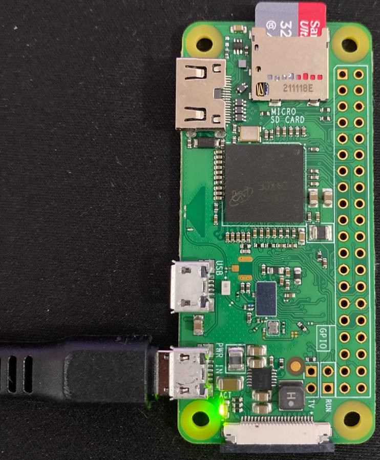

# WIP

#### RFC HMC253 SPT8T Switch

Commutation schematic:

| output | pin1 | pin2 | pin3 |
|-------|------|------|------|
| Rf1   | 0    | 0    | 0    |
| Rf2   | 1    | 0    | 0    |
| Rf3   | 0    | 1    | 0    |
| Rf4   | 1    | 1    | 0    |
| Rf5   | 0    | 0    | 1    |
| Rf6   | 1    | 0    | 1    |
| Rf7   | 0    | 1    | 1    |
| Rf8   | 1    | 1    | 1    |

#### Raspberry Pi Zero W v1.1

https://cdn.sparkfun.com/assets/learn_tutorials/6/7/6/PiZero_1.pdf

Used the [Raspberry Pi OS (32-bit)](https://www.raspberrypi.com/software/operating-systems/)
